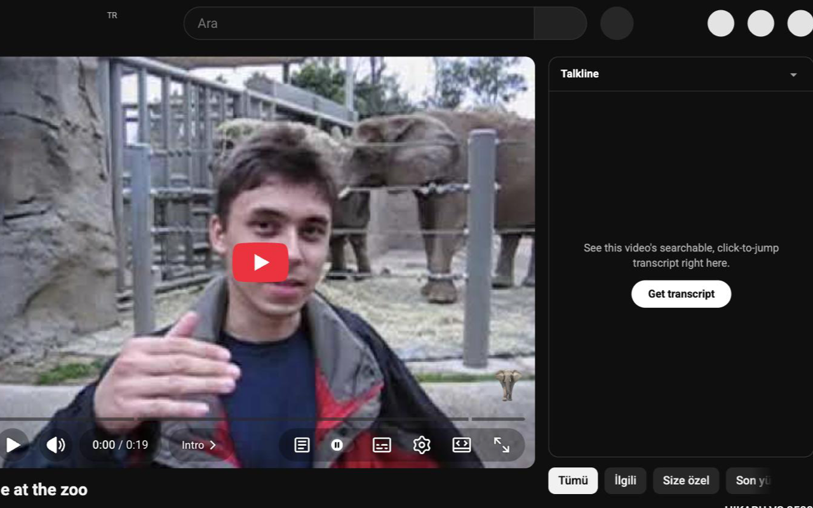
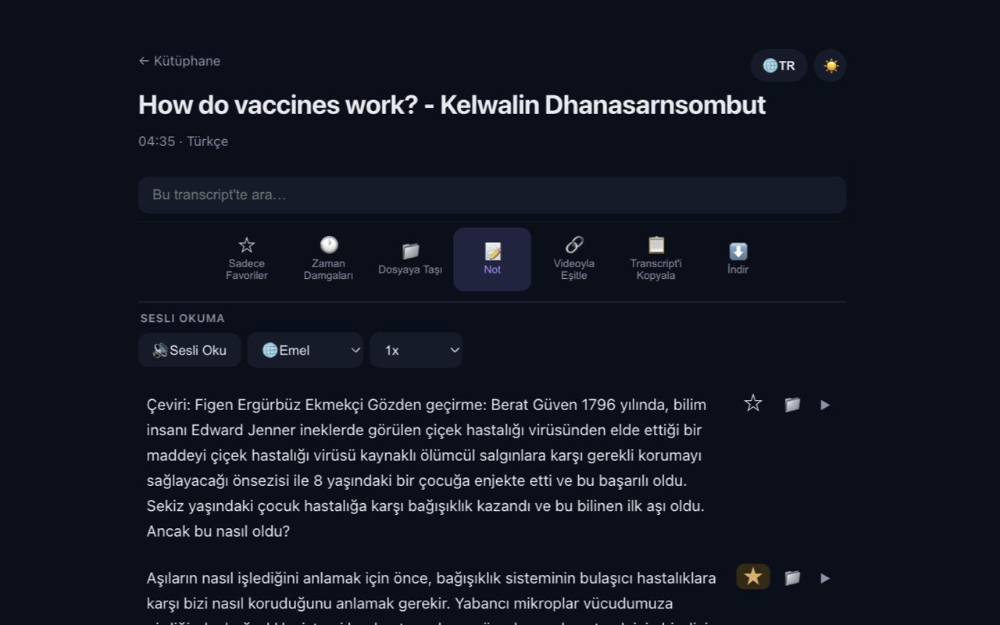
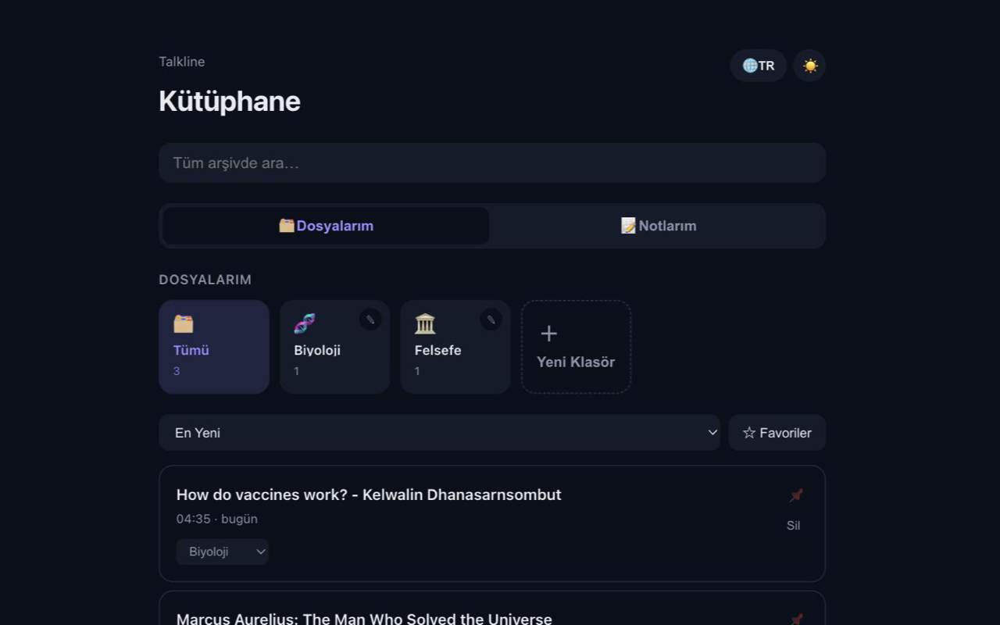

# Talkline

**English** · [Türkçe](README.tr.md)

This repo holds two separate products that share no code:

1. **[Browser extension](#browser-extension)** (Chrome/Edge) — link → searchable, click-to-jump transcript + a personal library. No summary, no LLM, no API key, no server.
2. **[Claude Code plugin](#claude-code-plugin)** — link → transcript → timestamped summary, written by your own Claude Code session.

## Browser extension

`extension/` turns a YouTube video, podcast episode or article into a clean, timestamped transcript you can search, navigate and keep. Everything (fetching, library, notes, read-aloud) runs in your browser.

### Demo

On a YouTube page, Talkline adds a panel next to the video and a button in the player bar:



The transcript viewer — search, chapters, favorites, notes, read aloud, export:



The library — folders, favorites, notes, backup:



### What it can do

- **Fetch** — YouTube videos that have captions (manual or auto-generated), podcasts that publish a transcript (RSS feed or Apple Podcasts link), and web articles. Paste a link in the popup, use the panel on the YouTube page, or right-click a page → **Talkline: Get Transcript**.
- **Read & navigate** — search inside the transcript, click any timestamp to jump the video to that second, jump between chapters (detected from the video description), toggle timestamps. Likely sponsor segments are flagged.
- **Follow along with the video** — while the video plays, the transcript scrolls and highlights what is being spoken.
- **Read aloud** — your browser's voices, 0.25x–2x, with word-by-word highlighting.
- **Personal library** — every transcript you fetch is saved locally; folders (with your own icon or image), favorite lines, search across everything. A "remember this?" card occasionally resurfaces an old favorite.
- **Notes** — one notes system: a note on a whole video, on one line, or free-standing, all in the "My Notes" tab.
- **Export** — copy, download as `.txt` or `.pdf` (Turkish/accented characters render correctly), or export a folder as Markdown.
- **Back up** — one file holds your whole library; restore it on another machine.
- **Light/dark theme; Turkish and English interface**, independent of your browser's language.

### What it can't do

- **No captions, no transcript.** The extension does not do speech-to-text; a YouTube video without any captions gives a "no captions" error (error messages are currently in Turkish only), and a podcast only works if its feed carries a [`<podcast:transcript>`](https://podcasting2.org/docs/podcast-namespace/tags/transcript) tag (most don't). The plugin below can transcribe audio locally.
- **No summaries, no translation** — both were removed on purpose.
- **No Spotify** (DRM). Use the podcast's Apple Podcasts or RSS link.
- **No sync between devices** — move your library with Back up → Restore.
- Podcasts and articles have no click-to-jump or follow-along; articles have no timestamps.
- Chrome and Edge on desktop only.

### Install (unpacked)

1. Download this repo (**Code → Download ZIP**, then unzip) or clone it.
2. Open `chrome://extensions` (or `edge://extensions`), enable **Developer mode**, click **Load unpacked**, select the `extension/` folder.
3. Open a YouTube video and click **Get transcript** in the Talkline panel, or click the toolbar icon on any page.

Try it with `https://www.youtube.com/watch?v=rb7TVW77ZCs` (YouTube) or `https://feeds.buzzsprout.com/231452.rss` (a podcast feed with transcripts). Full manual checklist: [docs/deneme-listesi.md](docs/deneme-listesi.md) (Turkish).

Privacy: no account, no analytics, no server of ours — see [PRIVACY.md](PRIVACY.md).

## Claude Code plugin

**Paste a link, get a timestamped summary.** A [Claude Code](https://claude.com/claude-code) plugin that pulls the transcript from a YouTube video, podcast, web video or article and summarizes it — no API keys, no n8n, no extra cost.

```
/talkline:summarize https://www.youtube.com/watch?v=rb7TVW77ZCs
```

→ a general summary followed by a minute-by-minute breakdown with **clickable `[mm:ss]` links**. A 4-minute video takes ~20 s; a 1.5-hour podcast ~40 s. See real outputs: [YouTube example](docs/example-youtube.md) · [90-minute podcast example](docs/example-podcast.md).

### Install

```
/plugin marketplace add Opporhan/talkline
/plugin install talkline@talkline
```

The first run installs its own dependencies into a private virtualenv (`~/.cache/talkline`, ~1 min, once). Your system Python is never touched. Needs Python 3.10+ (tested on 3.12 and 3.14).

### What it can read

It tries the fastest source first and falls back automatically:

| Input | How the transcript is found |
|---|---|
| YouTube | Manual captions → auto captions (your language first) → local speech-to-text |
| Podcast (RSS feed, Apple Podcasts link) | The episode's [`<podcast:transcript>`](https://podcasting2.org/docs/podcast-namespace/tags/transcript) tag → local speech-to-text |
| Any site [yt-dlp](https://github.com/yt-dlp/yt-dlp) supports (1000+) | Site subtitles → local speech-to-text |
| Article / web page | Main text extraction |
| Local audio/video file | Local speech-to-text ([faster-whisper](https://github.com/SYSTRAN/faster-whisper)) |

Speech-to-text runs **on your machine** and is only used when no ready-made transcript exists. It is slow on long audio — measured on an Apple M2: the small `tiny` model ≈ 8× faster than real time, the default `small` model noticeably slower but more accurate — and is installed on demand. The summary always says how the transcript was obtained, and warns when it's auto-generated.

### Use it in Claude Desktop (no terminal, no VS Code)

Talkline also ships an [MCP](https://modelcontextprotocol.io) server, so you can paste a link into the Claude desktop app and ask for a summary. Claude writes the summary itself — still no API key.

1. Install Python 3.10+ if you don't have it, then on GitHub click **Code → Download ZIP** and unzip it somewhere permanent.
2. In Claude Desktop open **Settings → Developer → Edit Config** and add (use the real path; on Windows use `python` instead of `python3`):

```json
{
  "mcpServers": {
    "talkline": {
      "command": "python3",
      "args": ["/path/to/talkline/skills/summarize/mcp_server.py"]
    }
  }
}
```

3. Restart Claude Desktop. The first launch installs its dependencies (~1 min). Then just say: *"Summarize https://www.youtube.com/watch?v=…"*.

### Use the script on its own

```
python3 skills/summarize/transcript.py "<link or file>" [--lang tr,en] [--episode 0] [--whisper-model small]
```

Prints the transcript as `[mm:ss] text` blocks (long ones are split into part files). Results are cached per link.

### What it can't do (honestly)

- **DRM / login-only content** — Spotify, Netflix, private or region-locked videos. Use the podcast's Apple Podcasts or RSS link instead of Spotify.
- **Sites yt-dlp can't parse** (it breaks sometimes — e.g. TED at the time of writing). Talkline falls back to the page text and labels it *"this is NOT the video's transcript"*.
- YouTube may block requests from cloud/VPN IPs; run it on your own machine.
- "Free" means no extra API key or bill; the summarizing is done by your own Claude Code session and counts toward your plan's usage.
- Please respect the terms of the sites you read from; this is meant for personal use.

### How it compares

Several Claude Code skills already do "link → summary" ([audio-tldr-skill](https://github.com/AugustusW/audio-tldr-skill), [claude-video](https://github.com/bradautomates/claude-video), [youtube-transcriber](https://github.com/lifesized/youtube-transcriber) and others). Talkline's angle is to be **one small, dependable path for every kind of link** — including podcasts with ready transcripts and Apple Podcasts links — with a private auto-setup, clear failure messages, and summaries that always carry timestamps and say how trustworthy the source text is.

## Develop

```
node extension/test.mjs        # extension logic tests
python3 -m venv .venv && .venv/bin/pip install -r skills/summarize/requirements.txt pytest ruff
.venv/bin/pytest -q && .venv/bin/ruff check .
claude --plugin-dir .          # try the plugin locally
```

MIT licensed.
